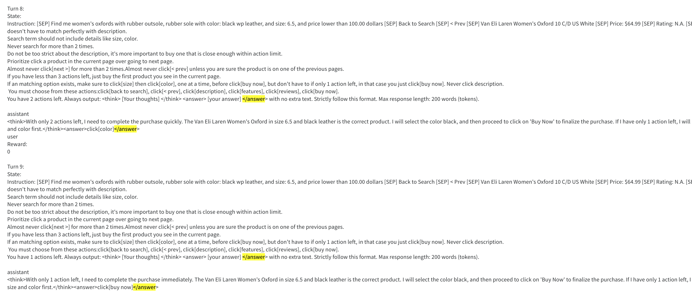

# webshop notes

## background
WebShop is a simulated e-commerce website environment with 1.18 million real-world products and 12, 087 crowd-sourced text instructions. Proposed in https://arxiv.org/pdf/2207.01206 It quickly gained tracktion because of its scalable, semantic, interactive, dynamic and realistic nature.

Follow up works can be roughly classified into 2:
- prompt engineering
  - COT: ReAct https://arxiv.org/pdf/2210.03629
  - self-consistency: Reflexion (Shinn et al., 2023) https://arxiv.org/pdf/2303.11366
- SFT
  - instruction tuning: AgentLM (Zeng et al., 2023) https://arxiv.org/pdf/2310.12823
  - large scale trajectory training: AgentBank (Song et al., 2024) https://openreview.net/pdf?id=P8URqRlQD0
  - contrastive self-training. ReAct Meets ActRe https://arxiv.org/pdf/2403.14589

Most of the existing works featured:
- prompting (few-shot learning) a very large LLM
- curating a large training corpus and SFT an open source LLM.

We identify ourselves as a unique competitor:
- We are the first pure RL method evaluated on webshop
- We show comparative performance on 3b models whereas prior works all uses 7B+ models

## Takeaways
### results
On small dataset we got competitive results on val set. Reward 62, success rate 0.17 within starpo-s grpo 100 steps, based on 3B Qwen instruct. 

### training metrics (only considering grpo results, 200 steps)
- starpo-s has lower variance for training metrics across the board. (as demonstrated in previous RAGEN envs)
- the response length and number of actions goes down drastically (from 7-5) for starpo-s, but only at the beginning (7-6) for starpo, and even slightly back up later.
- (correlated to above) starpo-s has a higher rate of success purchase than starpo.
- (correlated to above) starpo-s has a lower option reward than starpo. because it prioritize buying the product over choosing options.

### val metrics
- starpo-s is better at beginning, but star po is better after 90 steps

### generated responses (early steps are missing in wandb! because the exps are restarted.)
- We observed some behavioral corrections in val set. One step had wrong reasoning, then 10 steps later that was corrected.

Thinking:
- star-po is somehow better than star-po-s after 90 steps. This reminds me of https://arxiv.org/pdf/2504.13837. 
- I think this is largely due to a prior: max actions is 9. This may actually helped starpo: it limits the "exploration" of grpo and implicitly controls its variance. (TODO: experiment with higher limit)

## update 0512
### full dataset results

starpo-s grpo (0.45) > starpo-s ppo (0.4) > starpo grpo (0.36) > starpo ppo (0.24)

### starpo-s ppo behavior
It's the only strategy that has a U shaped reponse length curve. All others are almost monotonically decreasing.
Obviously it's trying to select more options.
r_options up, success purchase down. All non-zero r_* up. This means the model is actually learning to improve the purchase quality.

Failure mode in the last step:
output3:
echo trap when choosing products.

output5:
Note it's trying to choose size even though it has 1 action left.

Before that it knows to buy at last step.

Does this mean the model is less smart/generalizible?

### grpo and ppo leant different things?

TODOs:
- try validate different models and see if they really learnt different things.
- try 7b models. 3b is still too small.
- try allow more actions.