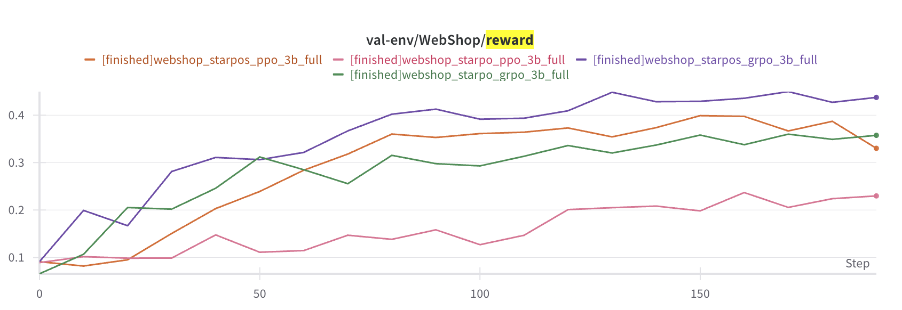
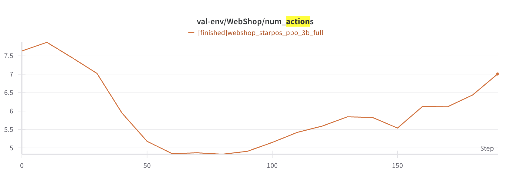
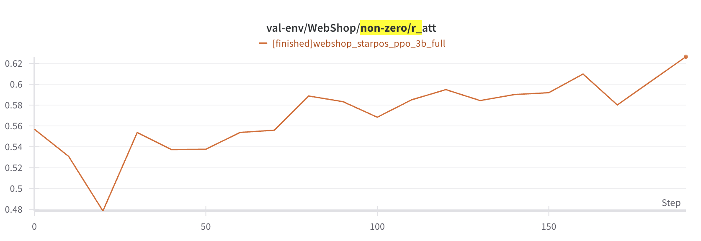
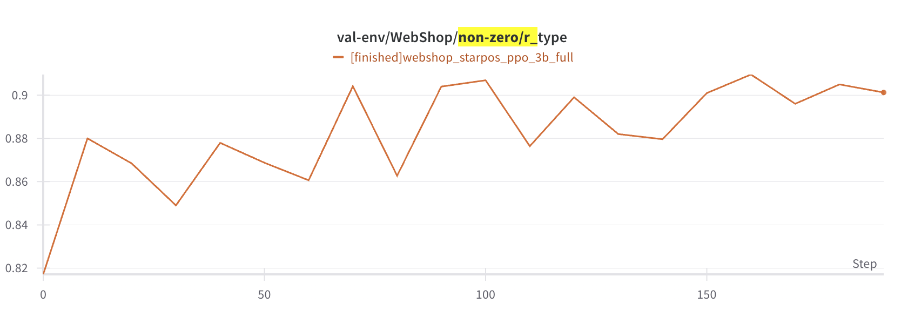
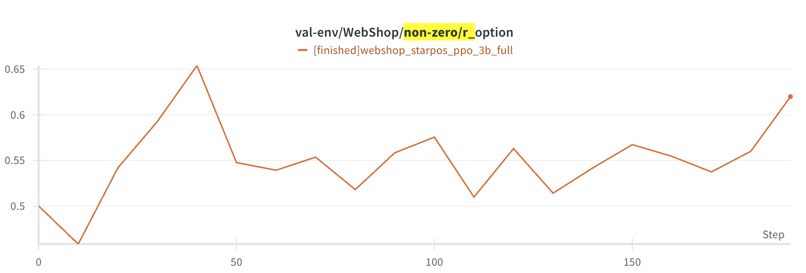

# webshop report

## Experiemnt setup
We conducted our experiments using 2 model sizes: Qwen2.5-0.5B-Instruct, Qwen2.5-3B-Instruct and 4 STARPO variants: starpo-s grpo, starpo-s ppo, starpo grpo, starpo ppo. For starpo we use 2 groups of size 16, for starpo-s we use 8 groups of size 16 and filter rate 0.25.

Due to resource constraints, we trained 200 steps for each model with a max trajectory length of 9.

## Results
None of the 0.5 models were able to get stablized positive training reward. For 3b models we got the task score (normalized to 0-1) on test set:

| training variant | starting test score | best test score |
|------------------|---------------------|-----------------|
| starpo-ppo       | 0.09                | 0.23            |
| starpo-grpo      | 0.07                | 0.36            |
| starpos-ppo      | 0.09                | 0.40            |
| starpos-grpo     | 0.09                | 0.45            |

## Observations and takeaways

### model size
Larger base model is better for schematic-rich task like webshop. We weren't be able to get any training reward for 0.5b model. We get reasonable training performance for 3b model. Preliminary results show that 7b model is better than 3b, despite that we haven't got complete training results for any 7b model yet due to prioritization and resource constraints.

### training scheme
Unlike tasks like sokoban, vanilla starpo works for webshop - no collapse has happened. That said, starpo-s remains superior to starpo like other tasks we have evaluated so far.

Within the same starpo scheme, GRPO performed better than PPO. We suspect that long-context task like webshop is more challenging for PPO with the extra critic model.

### prompting
Webshop is more sensitive to prompt than other tasks we've evaluated so far. Our current prompt is not really optimal, but it lifed the initial performance of 3b models. We believe this phenomenon is due to the fact that webshop is complicated, schematic-rich task which requires more reasoning ability from the base model. With larger base models, the affect of prompting should be less prominent.

### max actions
We observed that max number of actions is correlated with the success rate. We chose 9 actions for 3b models as a balance between performance and memory consumption. Allowing more actions may help/hurt performance.

### perculiar behavior of starpo-s ppo
Starpo-s ppo is the only strategy that has a U shaped reponse length curve - first decrease then increase. All others' reponse length are almost monotonically decreasing.

Looking at the training behavior, we found at the beginning of training, the model often behaves echo trap when choosing products - it ponders on the product or search page and doesn't buy anything. Over time, the model learns to buy a product within the turn limit, which results in a decrease in response length. Nevertheless, to achieve a higher reward, the model realizes to choose more options, which was reflected in an increase in response length.

The behavior is confirmed by r_options going up, success purchase going down. All non-zero reward went up. 
This means the model is actually learning to improve the purchase quality. This is encouraging, but we need to further understand why this only happens in starpo-s ppo.

### failure modes
There're still some failure modes the model needs to learn after 200 steps, like:
- over confidence in buying the wrong product
- echoing when choosing options

### limitations and next steps
If we compare the trajectory generated by a model against the optimal trajectory by human expert, it's notable that the model is under explored on search phase and over explored on purchase phase. It's very hard for the model to learn exploring the product pages meticulously and extensively while being precise and decisive on the purchase phase. This requires the rollout sample generation to be smart enough in balancing between exploration and exploitation across different turns. This could mean a more sophisticated reward modeling and/or a bigger model. We need to at least evaluate on 7b models - which is the smallest model size evaluated on webshop in other works.

# Appendix

## failure mode 1
(starpo-s grpo)
system
You're a helpful assistant. 
user
You are browsing an online shop. Based on the instruction, buy a product that close to the production description. You need to search, read the search results, pick a product, choose the size and color and buy. You should only choose action from the available actions list provided later.  Example process: I need a gingko light and 20x20 pillow cover that is hand painted. First search[gingko light 20x20 pillow cover hand painted], answer format: <answer>search[blanket with fleece throw]</answer>. Valid answer is search[<keywords>] or click[<clickable>].
Turn 1:
State:
Instruction: Find me wash cold, machine wash men's sleep & lounge with relaxed fit for tumble dry with color: with blue strpe pant, and size: x-large, and price lower than 70.00 dollars.We must buy a product within 10 actions. It doesn't have to match perfectly with description.
Search term should not include details like size, color.
Never search for more than 2 times.
Do not be too strict about the description, it's more important to buy one that is close enough within action limit.
Prioritize click a product in the current page over going to next page.
Almost never click[next >] for more than 2 times.Almost never click[< prev] unless you are sure the product is on one of the previous pages.
If you have less than 3 actions left, just buy the first product you see in the current page.
If an matching option exists, make sure to click[size] then click[color], one at a time, before click[buy now], but don't have to if only 1 action left, in that case you just click[buy now]. Never click description.
 You must choose from these actions:search[<content>].
You have 9 actions left. Always output: <think> [Your thoughts] </think> <answer> [your answer] </answer> with no extra text. Strictly follow this format. Max response length: 200 words (tokens).

assistant
<think>Let's start by searching for wash cold, machine wash men's sleep & lounge with relaxed fit pants that have a blue stripe and are priced under $70.00.</think><answer>search[wash cold, machine wash men's sleep & lounge with relaxed fit blue stripe pants price under 70]</answer>
user
Reward:
0.0

Turn 2:
State:
Instruction: [SEP] Find me wash cold, machine wash men's sleep & lounge with relaxed fit for tumble dry with color: with blue strpe pant, and size: x-large, and price lower than 70.00 dollars [SEP] Back to Search [SEP] Page 1 (Total results: 50) [SEP] Next > [SEP] B099231V35 [SEP] Mens Casual Cargo Pants Hi Vis Viz Reflective Overalls High Visibility Safe Work Pants Outdoor Hiking Trousers Big and Tall [SEP] $16.79 [SEP] B09QCVCYVY [SEP] Burband Womens High Waist Bike Shorts Tummy Control Workout Yoga Pants Running Exercise Running Shorts with Side Pockets [SEP] $6.82 [SEP] B09ND8P2QR [SEP] InterestPrint Deer and Stars Men's Loungewear Pajama Sets - Long Sleeve Tee and Jogger Pant [SEP] $43.59 [SEP] B09ND9DP7J [SEP] InterestPrint Gold Horse Pattern Men's 2-Piece Sleepwear Set, Long Sleeve Shirt with Pants Loungewear [SEP] $43.59 [SEP] B098B8KGMB [SEP] Sheer Lace G-String For Men Floral Briefs Sexy T-Back Underwears See Through G-Strings Jockstrap Bikini Briefs [SEP] $2.99 [SEP] B0836D6CW4 [SEP] Sunbeam Heated Electric Fleece Throw Comforter Blanket with Controller, Auto Off Setting, Thermofine Wiring, and 3 Heat Settings, Red Plaid [SEP] $45.99 [SEP] B09Q67H373 [SEP] JSPOYOU 2022 Newly T-Shirt for Mens Funny 3D Graphics Pattern Crewneck Short Sleeve Tees Big and Tall Summer Casual Comfy Top [SEP] $1.99 to $8.99 [SEP] B09NNMV9LN [SEP] JSPOYOU Mens Short Sleeve Crewneck 3D Graphic Tunic Shirts Big & Tall Tie Dye Summer Top Basic Designed Classic Cotton Shirt [SEP] $3.99 to $10.99 [SEP] B09DD2C1XD [SEP] Beaupretty 8pcs Kids Nightcaps Hair Bonnets Sleeping Caps Hair Protection Wide Rim Hat Bath Shower Accessories for Home [SEP] $19.99 [SEP] B09QQP3356 [SEP] HAUKLIE Men's Sports Waffle Ribbed Polo Shirts Summer Short Sleeve Cotton Muscle Quarter-Zip Henley T-Shirt Tunics Tops [SEP] $10.99.We must buy a product within 10 actions. It doesn't have to match perfectly with description.
Search term should not include details like size, color.
Never search for more than 2 times.
Do not be too strict about the description, it's more important to buy one that is close enough within action limit.
Prioritize click a product in the current page over going to next page.
Almost never click[next >] for more than 2 times.Almost never click[< prev] unless you are sure the product is on one of the previous pages.
If you have less than 3 actions left, just buy the first product you see in the current page.
If an matching option exists, make sure to click[size] then click[color], one at a time, before click[buy now], but don't have to if only 1 action left, in that case you just click[buy now]. Never click description.
 You must choose from these actions:click[back to search], click[next >], click[b099231v35], click[b09qcvcyvy], click[b09nd8p2qr], click[b09nd9dp7j], click[b098b8kgmb], click[b0836d6cw4], click[b09q67h373], click[b09nnmv9ln], click[b09dd2c1xd], click[b09qqp3356].
You have 8 actions left. Always output: <think> [Your thoughts] </think> <answer> [your answer] </answer> with no extra text. Strictly follow this format. Max response length: 200 words (tokens).

assistant
<think>Based on the search results, the closest match to the instruction is the men's casual cargo pants with a blue stripe. However, it's not available in an x-large size and the price is not under $70.00. I will prioritize clicking on the next available option, which is the B099231V35 men's casual cargo pants with a blue stripe.</think><answer>click[B099231V35]</answer>
user
Reward:
0.0

Turn 3:
State:
Instruction: [SEP] Find me wash cold, machine wash men's sleep & lounge with relaxed fit for tumble dry with color: with blue strpe pant, and size: x-large, and price lower than 70.00 dollars [SEP] Back to Search [SEP] < Prev [SEP] color [SEP] black [SEP] green [SEP] orange [SEP] yellow [SEP] size [SEP] small [SEP] medium [SEP] large [SEP] x-large [SEP] xx-large [SEP] 3x-large [SEP] Mens Casual Cargo Pants Hi Vis Viz Reflective Overalls High Visibility Safe Work Pants Outdoor Hiking Trousers Big and Tall [SEP] Price: $16.79 [SEP] Rating: N.A. [SEP] Description [SEP] Features [SEP] Reviews [SEP] Buy Now.We must buy a product within 10 actions. It doesn't have to match perfectly with description.
Search term should not include details like size, color.
Never search for more than 2 times.
Do not be too strict about the description, it's more important to buy one that is close enough within action limit.
Prioritize click a product in the current page over going to next page.
Almost never click[next >] for more than 2 times.Almost never click[< prev] unless you are sure the product is on one of the previous pages.
If you have less than 3 actions left, just buy the first product you see in the current page.
If an matching option exists, make sure to click[size] then click[color], one at a time, before click[buy now], but don't have to if only 1 action left, in that case you just click[buy now]. Never click description.
 You must choose from these actions:click[back to search], click[< prev], click[description], click[features], click[reviews], click[buy now], click[black], click[green], click[orange], click[yellow], click[small], click[medium], click[large], click[x-large], click[xx-large], click[3x-large].
You have 7 actions left. Always output: <think> [Your thoughts] </think> <answer> [your answer] </answer> with no extra text. Strictly follow this format. Max response length: 200 words (tokens).

assistant
<think>Given the current page only shows one product, I will prioritize clicking on the product to select the size and color, as it's within the action limit.</think><answer>click[buy now]</answer>

## failure mode 2
(starpo-ppo)
system
You're a helpful assistant. 
user
You are browsing an online shop. Based on the instruction, buy a product that close to the production description. You need to search, read the search results, pick a product, choose the size and color and buy. You should only choose action from the available actions list provided later.  Example process: I need a gingko light and 20x20 pillow cover that is hand painted. First search[gingko light 20x20 pillow cover hand painted], answer format: <answer>search[blanket with fleece throw]</answer>. Valid answer is search[<keywords>] or click[<clickable>].
Turn 1:
State:
Instruction: Find me hand wash, loose fit, wash cold, machine wash women's shorts with elastic waist, elastic closure, high waist for daily wear with color: 5-green, and size: small, and price lower than 50.00 dollars.We must buy a product within 10 actions. It doesn't have to match perfectly with description.
Search term should not include details like size, color.
Never search for more than 2 times.
Do not be too strict about the description, it's more important to buy one that is close enough within action limit.
Prioritize click a product in the current page over going to next page.
Almost never click[next >] for more than 2 times.Almost never click[< prev] unless you are sure the product is on one of the previous pages.
If you have less than 3 actions left, just buy the first product you see in the current page.
If an matching option exists, make sure to click[size] then click[color], one at a time, before click[buy now], but don't have to if only 1 action left, in that case you just click[buy now]. Never click description.
 You must choose from these actions:search[<content>].
You have 9 actions left. Always output: <think> [Your thoughts] </think> <answer> [your answer] </answer> with no extra text. Strictly follow this format. Max response length: 200 words (tokens).

assistant
<think>First, I need to construct a search term that captures all the specified criteria: hand wash, loose fit, wash cold, machine wash, women's shorts, elastic waist, elastic closure, high waist, daily wear, color: 5-green, size: small, and price lower than $50.00. The key elements are the type of shorts, the fit, the wash instructions, the waist type, the color, and the size and price. I will put all these elements together in the search term.</think><answer>search[hand wash loose fit women's shorts elastic waist high waist daily wear 5-green small size 50]</answer>
user
Reward:
0.0

Turn 2:
State:
Instruction: [SEP] Find me hand wash, loose fit, wash cold, machine wash women's shorts with elastic waist, elastic closure, high waist for daily wear with color: 5-green, and size: small, and price lower than 50.00 dollars [SEP] Back to Search [SEP] Page 1 (Total results: 50) [SEP] Next > [SEP] B09QCVCYVY [SEP] Burband Womens High Waist Bike Shorts Tummy Control Workout Yoga Pants Running Exercise Running Shorts with Side Pockets [SEP] $6.82 [SEP] B099231V35 [SEP] Mens Casual Cargo Pants Hi Vis Viz Reflective Overalls High Visibility Safe Work Pants Outdoor Hiking Trousers Big and Tall [SEP] $16.79 [SEP] B09Q5ZHRVM [SEP] Yinimo Mens Gym Shorts Fashionable Loose Beach Drawstring Turkey Print Beach Cool Shorts [SEP] $19.19 [SEP] B09PYSKD7H [SEP] FIN86 Men's Elastic High Waisted Shorts,Men's Summer Printed Casual Shorts Loose Tether Pocket Board Shorts [SEP] $9.98 to $12.98 [SEP] B09M63B87V [SEP] YALFJV Women Long Sleeve Crew Neck Side Button T Shirts Tunic Dress Loose Asymmetric Hem Tunic Pullover to Wear with Leggings [SEP] $10.71 to $18.34 [SEP] B09QCP4579 [SEP] LWLW High Waist Yoga Shorts for Women,Tummy Control Biker Shorts Exercise Workout Butt Lifting Tights Women's Short Pants [SEP] $13.99 [SEP] B08KYBVQ46 [SEP] adidas Originals Women's Adicolor Essentials Tights [SEP] $16.82 to $35.0 [SEP] B09PBPZ24Z [SEP] myhehthw Women's High Waisted Jeans for Women Distressed Ripped Jeans Slim Fit Butt Lifting Skinny Stretch Jeans Trousers [SEP] $22.99 to $25.99 [SEP] B09MSZ4VS8 [SEP] Goldweather Women Winter Leggings Printed Warm Fleece Lined Yoga Pants Trousers Thermal High Waist Thicken Cashmere Tights (Navy, L) [SEP] $20.99 [SEP] B09NNMV9LN [SEP] JSPOYOU Mens Short Sleeve Crewneck 3D Graphic Tunic Shirts Big & Tall Tie Dye Summer Top Basic Designed Classic Cotton Shirt [SEP] $3.99 to $10.99.We must buy a product within 10 actions. It doesn't have to match perfectly with description.
Search term should not include details like size, color.
Never search for more than 2 times.
Do not be too strict about the description, it's more important to buy one that is close enough within action limit.
Prioritize click a product in the current page over going to next page.
Almost never click[next >] for more than 2 times.Almost never click[< prev] unless you are sure the product is on one of the previous pages.
If you have less than 3 actions left, just buy the first product you see in the current page.
If an matching option exists, make sure to click[size] then click[color], one at a time, before click[buy now], but don't have to if only 1 action left, in that case you just click[buy now]. Never click description.
 You must choose from these actions:click[back to search], click[next >], click[b09qcvcyvy], click[b099231v35], click[b09q5zhrvm], click[b09pyskd7h], click[b09m63b87v], click[b09qcp4579], click[b08kybvq46], click[b09pbpz24z], click[b09msz4vs8], click[b09nnmv9ln].
You have 8 actions left. Always output: <think> [Your thoughts] </think> <answer> [your answer] </answer> with no extra text. Strictly follow this format. Max response length: 200 words (tokens).

assistant
<think>Given the remaining actions and the need to quickly identify the correct product, I should focus on clicking on the product that matches the exact description. The product I'm looking for is a hand wash, loose fit, wash cold, machine wash women's shorts with elastic waist, high waist, and a green color, in a small size, and priced below $50. The key product is B09QCVCYVY, which is a women's high-waisted, hand-washable shorts with a 5-green color and a size small. I should prioritize clicking on this product as it is the most likely match. With 8 actions left, I can then proceed to click on the size and color, and proceed to "Buy Now" without needing to search further.</think><answer>click[B09QCVCYVY]</answer>
user
Reward:
0.0

Turn 3:
State:
Instruction: [SEP] Find me hand wash, loose fit, wash cold, machine wash women's shorts with elastic waist, elastic closure, high waist for daily wear with color: 5-green, and size: small, and price lower than 50.00 dollars [SEP] Back to Search [SEP] < Prev [SEP] color [SEP] black [SEP] blue [SEP] dark gray [SEP] gray [SEP] navy [SEP] red [SEP] silver [SEP] size [SEP] small [SEP] medium [SEP] large [SEP] x-large [SEP] xx-large [SEP] Burband Womens High Waist Bike Shorts Tummy Control Workout Yoga Pants Running Exercise Running Shorts with Side Pockets [SEP] Price: $6.82 [SEP] Rating: N.A. [SEP] Description [SEP] Features [SEP] Reviews [SEP] Buy Now.We must buy a product within 10 actions. It doesn't have to match perfectly with description.
Search term should not include details like size, color.
Never search for more than 2 times.
Do not be too strict about the description, it's more important to buy one that is close enough within action limit.
Prioritize click a product in the current page over going to next page.
Almost never click[next >] for more than 2 times.Almost never click[< prev] unless you are sure the product is on one of the previous pages.
If you have less than 3 actions left, just buy the first product you see in the current page.
If an matching option exists, make sure to click[size] then click[color], one at a time, before click[buy now], but don't have to if only 1 action left, in that case you just click[buy now]. Never click description.
 You must choose from these actions:click[back to search], click[< prev], click[description], click[features], click[reviews], click[buy now], click[black], click[blue], click[dark gray], click[gray], click[navy], click[red], click[silver], click[small], click[medium], click[large], click[x-large], click[xx-large].
You have 7 actions left. Always output: <think> [Your thoughts] </think> <answer> [your answer] </answer> with no extra text. Strictly follow this format. Max response length: 200 words (tokens).

assistant
<think>With 7 actions left, I need to quickly narrow down the options and make a decision. The key details are the hand wash, loose fit, wash cold, machine wash, women's shorts, elastic waist, high waist, color: 5-green, and size: small, with a price under $50. The product I clicked on earlier (B09QCVCYVY) is no longer available, so I need to find another option that matches the description. The product I'm looking for is the same as the one I clicked on before, but in a different color. The most relevant product is B09QCVCYVY, which is a women's high-waisted, hand-washable shorts with a 5-green color and a size small. I should prioritize clicking on this product again, as it is the most likely match. With the remaining actions, I can then select the size small and then the color green. If I have less than 3 actions left, I will just buy the first green small option I see. Given the remaining actions, I can proceed to click on the color green.</think><answer>click[green]</answer>
user
Reward:
0

Turn 4:
State:
Instruction: [SEP] Find me hand wash, loose fit, wash cold, machine wash women's shorts with elastic waist, elastic closure, high waist for daily wear with color: 5-green, and size: small, and price lower than 50.00 dollars [SEP] Back to Search [SEP] < Prev [SEP] color [SEP] black [SEP] blue [SEP] dark gray [SEP] gray [SEP] navy [SEP] red [SEP] silver [SEP] size [SEP] small [SEP] medium [SEP] large [SEP] x-large [SEP] xx-large [SEP] Burband Womens High Waist Bike Shorts Tummy Control Workout Yoga Pants Running Exercise Running Shorts with Side Pockets [SEP] Price: $6.82 [SEP] Rating: N.A. [SEP] Description [SEP] Features [SEP] Reviews [SEP] Buy Now.We must buy a product within 10 actions. It doesn't have to match perfectly with description.
Search term should not include details like size, color.
Never search for more than 2 times.
Do not be too strict about the description, it's more important to buy one that is close enough within action limit.
Prioritize click a product in the current page over going to next page.
Almost never click[next >] for more than 2 times.Almost never click[< prev] unless you are sure the product is on one of the previous pages.
If you have less than 3 actions left, just buy the first product you see in the current page.
If an matching option exists, make sure to click[size] then click[color], one at a time, before click[buy now], but don't have to if only 1 action left, in that case you just click[buy now]. Never click description.
 You must choose from these actions:click[back to search], click[< prev], click[description], click[features], click[reviews], click[buy now], click[black], click[blue], click[dark gray], click[gray], click[navy], click[red], click[silver], click[small], click[medium], click[large], click[x-large], click[xx-large].
You have 6 actions left. Always output: <think> [Your thoughts] </think> <answer> [your answer] </answer> with no extra text. Strictly follow this format. Max response length: 200 words (tokens).

assistant
<think>Given the remaining 6 actions, I need to make a quick decision. The key details are the hand wash, loose fit, wash cold, machine wash, women's shorts, elastic waist, high waist, color: 5-green, and size: small, with a price under $50. The product I clicked on earlier (B09QCVCYVY) is no longer available, so I need to focus on the current page. The product I'm looking for is the same green high-waisted shorts, but I need to select the size small. With only 6 actions left, I should prioritize selecting the size and color quickly. The most relevant product is still B09QCVCYVY, which is the green high-waisted shorts. I should click on the size small, then the color green, and proceed to "Buy Now" if there are enough actions left. If I have less than 3 actions left, I will just buy the first green small option I see. Given the remaining actions, I can proceed to click on the size small.</think><answer>click[small]</answer>
user
Reward:
0.0

Turn 5:
State:
Instruction: [SEP] Find me hand wash, loose fit, wash cold, machine wash women's shorts with elastic waist, elastic closure, high waist for daily wear with color: 5-green, and size: small, and price lower than 50.00 dollars [SEP] Back to Search [SEP] < Prev [SEP] color [SEP] black [SEP] blue [SEP] dark gray [SEP] gray [SEP] navy [SEP] red [SEP] silver [SEP] size [SEP] small [SEP] medium [SEP] large [SEP] x-large [SEP] xx-large [SEP] Burband Womens High Waist Bike Shorts Tummy Control Workout Yoga Pants Running Exercise Running Shorts with Side Pockets [SEP] Price: $6.82 [SEP] Rating: N.A. [SEP] Description [SEP] Features [SEP] Reviews [SEP] Buy Now.We must buy a product within 10 actions. It doesn't have to match perfectly with description.
Search term should not include details like size, color.
Never search for more than 2 times.
Do not be too strict about the description, it's more important to buy one that is close enough within action limit.
Prioritize click a product in the current page over going to next page.
Almost never click[next >] for more than 2 times.Almost never click[< prev] unless you are sure the product is on one of the previous pages.
If you have less than 3 actions left, just buy the first product you see in the current page.
If an matching option exists, make sure to click[size] then click[color], one at a time, before click[buy now], but don't have to if only 1 action left, in that case you just click[buy now]. Never click description.
 You must choose from these actions:click[back to search], click[< prev], click[description], click[features], click[reviews], click[buy now], click[black], click[blue], click[dark gray], click[gray], click[navy], click[red], click[silver], click[small], click[medium], click[large], click[x-large], click[xx-large].
You have 5 actions left. Always output: <think> [Your thoughts] </think> <answer> [your answer] </answer> with no extra text. Strictly follow this format. Max response length: 200 words (tokens).

assistant
<think>With only 5 actions left, I need to make a quick and decisive action. The key details are the hand wash, loose fit, wash cold, machine wash, women's shorts, elastic waist, high waist, color: 5-green, and size: small, with a price under $50. The product I clicked on earlier (B09QCVCYVY) is no longer available, so I need to focus on the current page. I should prioritize selecting the size and color as quickly as possible. The most relevant product is still B09QCVCYVY, which is the green high-waisted shorts. Given the remaining actions, I should click on the color green next, as this will allow me to proceed to the size selection and then the "Buy Now" button if there are enough actions left. If I have less than 3 actions left, I will just buy the first green option I see. With 5 actions left, I should click on the color green to proceed.</think><answer>click[green]</answer>
user
Reward:
0

Turn 6:
State:
Instruction: [SEP] Find me hand wash, loose fit, wash cold, machine wash women's shorts with elastic waist, elastic closure, high waist for daily wear with color: 5-green, and size: small, and price lower than 50.00 dollars [SEP] Back to Search [SEP] < Prev [SEP] color [SEP] black [SEP] blue [SEP] dark gray [SEP] gray [SEP] navy [SEP] red [SEP] silver [SEP] size [SEP] small [SEP] medium [SEP] large [SEP] x-large [SEP] xx-large [SEP] Burband Womens High Waist Bike Shorts Tummy Control Workout Yoga Pants Running Exercise Running Shorts with Side Pockets [SEP] Price: $6.82 [SEP] Rating: N.A. [SEP] Description [SEP] Features [SEP] Reviews [SEP] Buy Now.We must buy a product within 10 actions. It doesn't have to match perfectly with description.
Search term should not include details like size, color.
Never search for more than 2 times.
Do not be too strict about the description, it's more important to buy one that is close enough within action limit.
Prioritize click a product in the current page over going to next page.
Almost never click[next >] for more than 2 times.Almost never click[< prev] unless you are sure the product is on one of the previous pages.
If you have less than 3 actions left, just buy the first product you see in the current page.
If an matching option exists, make sure to click[size] then click[color], one at a time, before click[buy now], but don't have to if only 1 action left, in that case you just click[buy now]. Never click description.
 You must choose from these actions:click[back to search], click[< prev], click[description], click[features], click[reviews], click[buy now], click[black], click[blue], click[dark gray], click[gray], click[navy], click[red], click[silver], click[small], click[medium], click[large], click[x-large], click[xx-large].
You have 4 actions left. Always output: <think> [Your thoughts] </think> <answer> [your answer] </answer> with no extra text. Strictly follow this format. Max response length: 200 words (tokens).

assistant
<think>With only 4 actions left, I need to make a quick and decisive move. The key details are that I'm looking for hand wash, loose fit, wash cold, machine wash women's shorts with an elastic waist, high waist, color 5-green, and size small, with a price under $50. The product I clicked on earlier (B09QCVCYVY) is no longer available, so I need to focus on the current page. I should prioritize selecting the color green next, as this will allow me to proceed to the size selection and then the "Buy Now" button if there are enough actions left. Given the limited actions, I should click on the color green to proceed. If I have less than 3 actions left, I will just buy the first green option I see. With 4 actions left, I should click on the color green to move forward.</think><answer>click[green]</answer>
user
Reward:
0

Turn 7:
State:
Instruction: [SEP] Find me hand wash, loose fit, wash cold, machine wash women's shorts with elastic waist, elastic closure, high waist for daily wear with color: 5-green, and size: small, and price lower than 50.00 dollars [SEP] Back to Search [SEP] < Prev [SEP] color [SEP] black [SEP] blue [SEP] dark gray [SEP] gray [SEP] navy [SEP] red [SEP] silver [SEP] size [SEP] small [SEP] medium [SEP] large [SEP] x-large [SEP] xx-large [SEP] Burband Womens High Waist Bike Shorts Tummy Control Workout Yoga Pants Running Exercise Running Shorts with Side Pockets [SEP] Price: $6.82 [SEP] Rating: N.A. [SEP] Description [SEP] Features [SEP] Reviews [SEP] Buy Now.We must buy a product within 10 actions. It doesn't have to match perfectly with description.
Search term should not include details like size, color.
Never search for more than 2 times.
Do not be too strict about the description, it's more important to buy one that is close enough within action limit.
Prioritize click a product in the current page over going to next page.
Almost never click[next >] for more than 2 times.Almost never click[< prev] unless you are sure the product is on one of the previous pages.
If you have less than 3 actions left, just buy the first product you see in the current page.
If an matching option exists, make sure to click[size] then click[color], one at a time, before click[buy now], but don't have to if only 1 action left, in that case you just click[buy now]. Never click description.
 You must choose from these actions:click[back to search], click[< prev], click[description], click[features], click[reviews], click[buy now], click[black], click[blue], click[dark gray], click[gray], click[navy], click[red], click[silver], click[small], click[medium], click[large], click[x-large], click[xx-large].
You have 3 actions left. Always output: <think> [Your thoughts] </think> <answer> [your answer] </answer> with no extra text. Strictly follow this format. Max response length: 200 words (tokens).

assistant
<think>With only 3 actions left, I need to make a decisive action quickly. The key details are that I'm looking for hand wash, loose fit, wash cold, machine wash women's shorts with an elastic waist, high waist, color 5-green, and size small, with a price under $50. The product I clicked on earlier (B09QCVCYVY) is no longer available, so I should focus on the current page. The most relevant product is still B09QCVCYVY, which is the green high-waisted shorts. Given the remaining actions, I should click on the size small next, as this will allow me to proceed to the color selection and then the "Buy Now" button if there are enough actions left. If I have less than 3 actions left, I will just buy the first small green option I see. With 3 actions left, I should click on the size small to proceed.</think><answer>click[small]</answer>
user
Reward:
0.0

Turn 8:
State:
Instruction: [SEP] Find me hand wash, loose fit, wash cold, machine wash women's shorts with elastic waist, elastic closure, high waist for daily wear with color: 5-green, and size: small, and price lower than 50.00 dollars [SEP] Back to Search [SEP] < Prev [SEP] color [SEP] black [SEP] blue [SEP] dark gray [SEP] gray [SEP] navy [SEP] red [SEP] silver [SEP] size [SEP] small [SEP] medium [SEP] large [SEP] x-large [SEP] xx-large [SEP] Burband Womens High Waist Bike Shorts Tummy Control Workout Yoga Pants Running Exercise Running Shorts with Side Pockets [SEP] Price: $6.82 [SEP] Rating: N.A. [SEP] Description [SEP] Features [SEP] Reviews [SEP] Buy Now.We must buy a product within 10 actions. It doesn't have to match perfectly with description.
Search term should not include details like size, color.
Never search for more than 2 times.
Do not be too strict about the description, it's more important to buy one that is close enough within action limit.
Prioritize click a product in the current page over going to next page.
Almost never click[next >] for more than 2 times.Almost never click[< prev] unless you are sure the product is on one of the previous pages.
If you have less than 3 actions left, just buy the first product you see in the current page.
If an matching option exists, make sure to click[size] then click[color], one at a time, before click[buy now], but don't have to if only 1 action left, in that case you just click[buy now]. Never click description.
 You must choose from these actions:click[back to search], click[< prev], click[description], click[features], click[reviews], click[buy now], click[black], click[blue], click[dark gray], click[gray], click[navy], click[red], click[silver], click[small], click[medium], click[large], click[x-large], click[xx-large].
You have 2 actions left. Always output: <think> [Your thoughts] </think> <answer> [your answer] </answer> with no extra text. Strictly follow this format. Max response length: 200 words (tokens).

assistant
<think>With only 2 actions left, I need to make a quick and decisive action. The key details are that I'm looking for hand wash, loose fit, wash cold, machine wash women's shorts with an elastic waist, high waist, color 5-green, and size small, with a price under $50. The product I clicked on earlier (B09QCVCYVY) is no longer available, so I should focus on the current page. The most relevant product is still B09QCVCYVY, which is the green high-waisted shorts. Given the limited actions, I should click on the size small next, as this will allow me to proceed to the color selection and then the "Buy Now" button if there are enough actions left. If I have less than 3 actions left, I will just buy the first small green option I see. With 2 actions left, I should click on the size small to proceed.</think><answer>click[small]</answer>
user
Reward:
0.0

Turn 9:
State:
Instruction: [SEP] Find me hand wash, loose fit, wash cold, machine wash women's shorts with elastic waist, elastic closure, high waist for daily wear with color: 5-green, and size: small, and price lower than 50.00 dollars [SEP] Back to Search [SEP] < Prev [SEP] color [SEP] black [SEP] blue [SEP] dark gray [SEP] gray [SEP] navy [SEP] red [SEP] silver [SEP] size [SEP] small [SEP] medium [SEP] large [SEP] x-large [SEP] xx-large [SEP] Burband Womens High Waist Bike Shorts Tummy Control Workout Yoga Pants Running Exercise Running Shorts with Side Pockets [SEP] Price: $6.82 [SEP] Rating: N.A. [SEP] Description [SEP] Features [SEP] Reviews [SEP] Buy Now.We must buy a product within 10 actions. It doesn't have to match perfectly with description.
Search term should not include details like size, color.
Never search for more than 2 times.
Do not be too strict about the description, it's more important to buy one that is close enough within action limit.
Prioritize click a product in the current page over going to next page.
Almost never click[next >] for more than 2 times.Almost never click[< prev] unless you are sure the product is on one of the previous pages.
If you have less than 3 actions left, just buy the first product you see in the current page.
If an matching option exists, make sure to click[size] then click[color], one at a time, before click[buy now], but don't have to if only 1 action left, in that case you just click[buy now]. Never click description.
 You must choose from these actions:click[back to search], click[< prev], click[description], click[features], click[reviews], click[buy now], click[black], click[blue], click[dark gray], click[gray], click[navy], click[red], click[silver], click[small], click[medium], click[large], click[x-large], click[xx-large].
You have 1 actions left. Always output: <think> [Your thoughts] </think> <answer> [your answer] </answer> with no extra text. Strictly follow this format. Max response length: 200 words (tokens).

assistant
<think>With only 1 action left, I need to make a final and decisive action. The key details are that I'm looking for hand wash, loose fit, wash cold, machine wash women's shorts with an elastic waist, high waist, color 5-green, and size small, with a price under $50. The product I clicked on earlier (B09QCVCYVY) is no longer available, so I should focus on the current page. The most relevant product is still B09QCVCYVY, which is the green high-waisted shorts. Given the limited actions, I should click on the size small next, as this will allow me to proceed to the color selection and then the "Buy Now" button if there are enough actions left. If I have less than 3 actions left, I will just buy the first small green option I see. With 1 action left, I should click on the size small to proceed.</think><answer>click[small]</answer>
